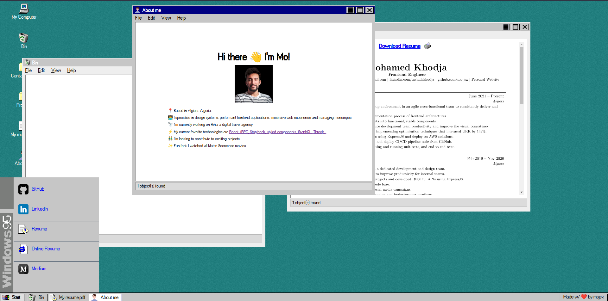
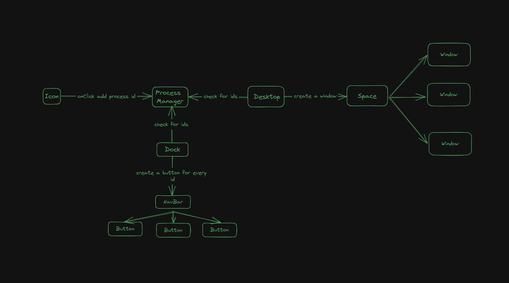

# [mojsx - Windows 95 Themed Portfolio](https://mojsx.vercel.app)

> version 1.0.0



## Frameworks & Libraries used

-   ⚛️ React
-   🐻 Zustand
-   🖌️ Sass
-   👋 Draggable

# FAQ

## Can I clone this project ?

-   Yes, you are free to use this project for personal use. Be warned ⚠️, I'm planning to make a second version very soon, focusing on the refactoring and optimizing the code and the assets as well.
-   No, most of the my image assets are imported within the project, in the upcoming iterations I will uploading them to an external server.

## How did you manage the state of the application

-   I used zustand, as its my new favorite pet 🐻, for its simplicity and 0-hassle 0-boilerplate code to setup a flux architecture.
-   I came to the conclusion that the most appropriate architecture for this project was quite simple and would be as follows:
     > Where every window added to the DOM, creates a process object in the Process Manger aka the store.

## Did you use any external CSS library/framework ?

-   No, the integrity of the application was crafted by me using Sass only. I took a considerable amount of time to get familiar with the Windows 95 design system.

## How long did it take you ?

-   I developed this application in my spare time for about 1 week. I had the opportunity to work on several projects with similar logic, so I spent most of my time doing CSS stuff.

## Do you plan any improvments ?

-   Yes! Besides refactoring and optimizing the application, I want to make this my pet project, where I can have fun trying new things and show off my latest work.

# Project Setup

### Clone project

```
https://github.com/mo-jsx/resume-95.git
```

### Install dependencies

```
npm install
```

### Run in development mode

```
npm run dev
```

### Run E2E tests

```
npm run cypress:open
```

### Build project

```
npm run build
```
